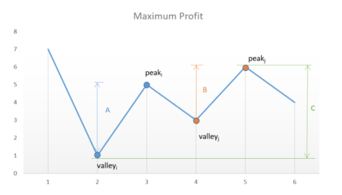
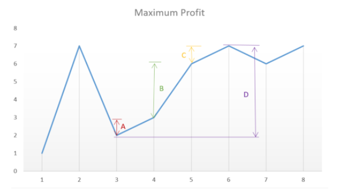
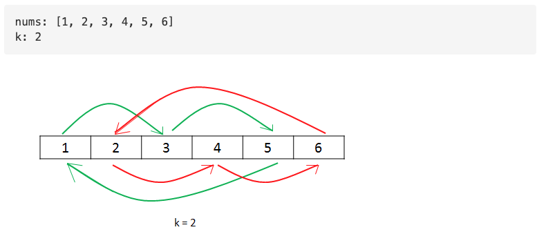
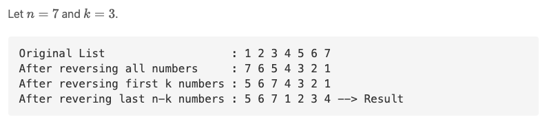

# Array
## Overview
*   **Easy:** Q1~Q11
*   **Medium:** Q12
*   **Worth it:** Q2, Q3, Q5, Q9, Q11, Q12, Q13, Q14
## Q1: Remove Duplicates from Sorted Array
*   My Solution is good enough
*   Logic: Find the first elements with the same value
## Q2: Best Time to Buy and Sell Stock II
###  My Solution
*   Flow
    * Step1: Remove duplicates in ***prices*** (list)
    * Step2: Iterate ***prices*** to record buying points and selling points
    * Step3: Compute ***maxProfit***
*   Cons
    * Time Complexity: Need to iterate ***prices*** two times
    * Space Complexity: Need two extra list ***buy*** and ***sell*** to store buying points and selling points
### LeetCode Solution: [Link](https://leetcode.com/articles/best-time-to-buy-and-sell-stock-ii/)
*   Approach 2: Peak Valley Approach   
    * The concepts of ***valley*** and ***peak*** are very similar with the concepts of ***buy*** and ***sell***
    * Better than My Solution
      * Time Complexity: Find respective ***valley/peak pair*** in one iteration
      * Space Complexity: Update ***maxProfit*** as soon as a ***valley/peak pair*** is found
      * ***peak/valley*** definitions can avoid necessity to ***remove duplicates***

        |  | My Solution | Approach 2 |
        | :-----| :----: | :----: |
        | valley | `(prices[i] < prices[i+1]) and (prices[i] < prices[i-1])` | `prices[i] < prices[i + 1]`|
        | peak | `(prices[i] > prices[i+1]) and (prices[i] > prices[i-1])` | `prices[i] > prices[i + 1]` |

```java
class Solution {
    public int maxProfit(int[] prices) {
        int i = 0;
        int valley = prices[0];
        int peak = prices[0];
        int maxprofit = 0;
        while (i < prices.length - 1) {
            while (i < prices.length - 1 && prices[i] >= prices[i + 1])
                i++;
            valley = prices[i];
            while (i < prices.length - 1 && prices[i] <= prices[i + 1])
                i++;
            peak = prices[i];
            maxprofit += peak - valley;
        }
        return maxprofit;
    }
}
```
*   Approach 3: Simple One Pass
    * In this case, instead of looking for every peak following a valley, we can simply go on crawling over the slope and keep on adding the profit obtained from every consecutive transaction.
    * Better than Approach 2
      * Easy to implement

 
```java
class Solution {
    public int maxProfit(int[] prices) {
        int maxprofit = 0;
        for (int i = 1; i < prices.length; i++) {
            if (prices[i] > prices[i - 1])
                maxprofit += prices[i] - prices[i - 1];
        }
        return maxprofit;
    }
}
```
## Q3: Rotate Array
### My Solution
*   Cons: 
    *   Time Complexity: Move ***iterStep*** steps at one time (`iterStep <= k`)
    *   Space complexity is not O(1)
### LeetCode Solution: [Link](https://leetcode.com/articles/rotate-array/)
*   Approach 3: Using Cyclic Replacements
    * ***k*** iterations: ***i-th*** iteration move all elements that satisfy `(index%k) == i` to correct positions
    * Better than My Solution:
      * Time Complexity: Move ***k*** steps at one time
      * Space Complexity: `O(1)`


```python
class Solution:
    def rotate(self, nums: List[int], k: int) -> None:
        n = len(nums)
        k %= n
        
        start = count = 0
        while count < n:
            current, prev = start, nums[start]
            while True:
                next_idx = (current + k) % n
                nums[next_idx], prev = prev, nums[next_idx]
                current = next_idx
                count += 1
                
                if start == current:
                    break
            start += 1
```
*   Approach 4: Using Reverse
    * Pros: (1) Easy to implement (2) No extra space is used
   

```python
class Solution:
    def reverse(self, nums: list, start: int, end: int) -> None:
        while start < end:
            nums[start], nums[end] = nums[end], nums[start]
            start, end = start + 1, end - 1
                
    def rotate(self, nums: List[int], k: int) -> None:
        n = len(nums)
        k %= n

        self.reverse(nums, 0, n - 1)
        self.reverse(nums, 0, k - 1)
        self.reverse(nums, k, n - 1)
```
## Q4: Contains Duplicate
### My Solution
*   My approach is the same as Approach #2
*   Time Complexity: `O(nlogn)` (sorting)
*   Space Complexity: `O(1)` (if **heapsort** is used)
### LeetCode Solution: [Link](https://leetcode.com/articles/contains-duplicate/)
*   Approach 3: Hash Table
    *  Time Complexity: `O(n)`
    *  Space Complexity: `O(n)`
    *  Note: If ***n*** is not large enough, Approach 3 is possibly slower than Approach 2.
```java
public boolean containsDuplicate(int[] nums) {
    Set<Integer> set = new HashSet<>(nums.length);
    for (int x: nums) {
        if (set.contains(x)) return true;
        set.add(x);
    }
    return false;
}
```
## Q5: Single Number
### My Solution
*   Sorting + Traverse (Similar with Approach 2 in Q4)
*   Time Complexity: `O(nlogn)` (sorting) --> X
*   Space Complexity: `O(1)` (if **heapsort** is used)
### LeetCode Solution: [Link](https://leetcode.com/articles/single-number/)
*   Approach 2: Hash Table
    *   Time Complexity: `O(n)`
    *   Space Complexity: `O(n)` --> X
*   Approach 3: Math
    *   Concept: ` 2 * (a+b+c) - (a+a+b+b+c) = c`
    *   Time Complexity: `O(n)`
    *   Space Complexity: `O(n)` --> X
```python
class Solution(object):
    def singleNumber(self, nums):
        """
        :type nums: List[int]
        :rtype: int
        """
        return 2 * sum(set(nums)) - sum(nums)
```
*   Approach 4: Bit Manipulation
    * Concept: `a xor a = 0`, `a xor 0 = a` --> `a xor b xor a = (a xor a) xor b = 0 xor b = b`
    * Time Complexity: `O(n)`
    * Space Complexity: `O(1)`
```python
def singleNumber(self, nums):
    """
    :type nums: List[int]
    :rtype: int
    """
    a = 0
    for i in nums:
        a ^= i
    return a
```
## Q6: Intersection of Two Arrays II
### My Solution:
*   HashMap 
*   Time Complexity: `O(n)`
*   Space Complexity: `O(n)`
### Follow Up: [Link](https://blog.csdn.net/CSerwangjun/article/details/103134862)
*   What if the given array is already sorted?
    *  Two pointers
    *  Time Complexity: `O(m+n)` (`len(nums1) == m` & `len(nums2) == n`)
    *  Space Complexity: `O(k)`  (`len(res) == k`)
*   What if nums1's size is small compared to nums2's size?
    *  Binary search
    *  Time Complexity: `O(mlogn)` --> `O(mlogn) < O(m+n) because m << n`
## Q7: Plus One
### My Solution:
*   This problem is very easy, and my solution is good enough.
## Q8: Move Zeros
### My Solution
*   My solution is similar with Approach 2.
*   Time Complexity: `O(n)` --> However, the total number of operations are still sub-optimal. 
*   Space Complexity: `O(1)`
### LeetCode Solution: [Link](https://leetcode.com/articles/move-zeroes/)
*   Approach 3: (Optimal)
```c++
void moveZeroes(vector<int>& nums) {
    for (int lastNonZeroFoundAt = 0, cur = 0; cur < nums.size(); cur++) {
        if (nums[cur] != 0) {
            swap(nums[lastNonZeroFoundAt++], nums[cur]);
        }
    }
}
```
## Q9: Two Sum
### My Solution
* Sort + 2-pointer
* Time Complexity: `O(nlogn)`
* Space Complexity: `O(n)`
### LeetCode Solution
* Approach 3: One-pass Hash Table
  * Time Complexity: `O(n)` (Each look up in the hash table costs only `O(1)` time)
  * Space Complexity: `O(n)`
```java
public int[] twoSum(int[] nums, int target) {
    Map<Integer, Integer> map = new HashMap<>();
    for (int i = 0; i < nums.length; i++) {
        int complement = target - nums[i];
        if (map.containsKey(complement)) {
            return new int[] { map.get(complement), i };
        }
        map.put(nums[i], i);
    }
    throw new IllegalArgumentException("No two sum solution");
}
```
## Q10: Valid Sudoku
### My Solution
*  Check row, solumn and subbox separately (Good enough)
*  Improvement: Replace List with HashTable (the cost of look up in HashTable is `O(1)`)
## Q11: Rotate Image
### Solution: [Link](https://blog.csdn.net/fuxuemingzhu/article/details/79451733)
* Hint: Rotate 90 degrees (clockwise) = (symmetric to x-axis) + (symmetric to 45 degrees axis)
## Q12: 3 Sum
### Solution: [Link](https://www.youtube.com/watch?v=F4UKF07-tvo)
* Hint: 
  * Sort list
  * Two pointer (j,k)
* Skip duplicate
  * (3Sum.py:16~23) Why ***j*** and ***k*** can be updated at the same time?
    * (`tmp = nums[i] + nums[j] + nums[k] = 0` and ***i*** is fixed)
    * If we just update ***j***, ***tmp*** will become positive. 
    * If we just update ***k***, ***tmp*** will become negative.
  * (3Sum.py:20~23)
    * (20~21): Update ***j*** until `nums[j]` is the leftmost element of new number
      * ex: [1,1,1,2,2,2,3,3,3], j = 1 --> (20~21) --> j = 3
    * (22~23): Update ***k*** until `nums[k]` is the rightmost element of new number
      * ex: [1,1,1,2,2,2,3,3,3], k = 8 --> (22~23) --> k = 5
  * Update the variable to a new number. Why? (Is `nums[j_old] == nums[j_new]` invalid?)
    * If `nums[j_old] == nums[j_new]` and ***i*** is fixed, the only possible solution is `nums[k_old] == nums[k_new]` and it will cause duplicate. (`[nums[i], nums[j_old], nums[k_old]` and `[nums[i], nums[j_new], nums[k_new]`)
* Optimization:
  * `nums[i] + nums[i+1] + nums[i+2] > 0` (smallest 3 elements)--> break
  * `nums[i] + nums[len(nums)-2] + nums[len(nums)-1] < 0` --> continue
  * Use variable: Method 1 is much faster than Method 2
```python
# method 1
while j < k:
    tmp = nums[i] + nums[j] + nums[k]
    if (tmp == 0):
        ans.append([nums[i],nums[j],nums[k]])
        j += 1
        k -= 1
        while (j<k and nums[j] == nums[j-1]):
            j += 1
        while (j<k and nums[k] == nums[k+1]):
            k -= 1
    elif (tmp < 0):
        j += 1
    else:
        k -= 1
# method 2
while j < k:
    if ((nums[i] + nums[j] + nums[k]) == 0):
        ans.append([nums[i],nums[j],nums[k]])
        j += 1
        k -= 1
        while (j<k and nums[j] == nums[j-1]):
            j += 1
        while (j<k and nums[k] == nums[k+1]):
            k -= 1
    elif ((nums[i] + nums[j] + nums[k]) < 0):
        j += 1
    else:
        k -= 1
```
## Q13: Set Matrix Zeroes
### My Solution
*   Hash Table: Record rows and columns that need to set zeroes
    *  My Solution is very similar with Approach 1.
*   Time Complexity: `O(mn)`
*   Space Complexity: `O(m+n)`
### LeetCode Solution: [Link](https://leetcode.com/articles/set-matrix-zeroes/)
*   Approach 3: `O(1)` Space, Efficient Solution
    *  `matrix[i][j] == 0` --> Set `matrix[i][0]` and `matrix[0][j]` to 0
    *  If the first element of row or column (i.e. `matrix[i][0]` and `matrix[0][j]`) is equal to 0, it means that this row/column needs to set zeroes.
    *  That is, the first row and first column is equivalent to the Hash Table in My Solution.
## Q14: Group Anagrams
### My Solution
*   Sort the element, and store the element to ***hash_table***
*   My solution is good enough