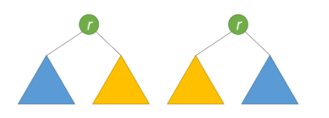

# Tree
## Overview
*   **Easy:** Q1 ~ Q5
*   **Medium:**
*   **Worth it:** Q1, Q2, Q3
## Q1: Maximum Depth of Binary Tree
### My Solution
*   Recursive (DFS)
*   TODO: try BFS
*   Clean version
```python
def maxDepth(self, root: TreeNode) -> int:
    if root == None:
        return 0
    return max(self.maxDepth(root.left), self.maxDepth(root.right)) + 1
```
## Q2: Valid Binary Search Tree
### My Solution
*   In-order traversal (Recursive) 
*   Check if the list is sorted
*   Time Complexity: `O(n)` --> Complexity is OK, but it can be more efficient
*   Space Complexity: `O(n)`
### LeetCode Solution: [Link](https://leetcode.com/problems/validate-binary-search-tree/solution/)
*   Approach 1: Recursion Approach
    *   upper/lower (start from root)
    *   Time Complexity: `O(n)`
    *   Space Complexity: `O(n)`
```python
class Solution:
    def isValidBST(self, root):
        """
        :type root: TreeNode
        :rtype: bool
        """
        def helper(node, lower = float('-inf'), upper = float('inf')):
            if not node:
                return True
            
            val = node.val
            if val <= lower or val >= upper:
                return False

            if not helper(node.right, val, upper):
                return False
            if not helper(node.left, lower, val):
                return False
            return True

        return helper(root)
```
*   Approach 2: Iteration
    *   upper/lower (start from root)
    * Time Complexity: `O(n)`
    * Space Complexity: `O(n)`
```python
class Solution:
    def isValidBST(self, root):
        """
        :type root: TreeNode
        :rtype: bool
        """
        if not root:
            return True
            
        stack = [(root, float('-inf'), float('inf')), ] 
        while stack:
            root, lower, upper = stack.pop()
            if not root:
                continue
            val = root.val
            if val <= lower or val >= upper:
                return False
            stack.append((root.right, val, upper))
            stack.append((root.left, lower, val))
        return True  
```
*   Approach 3: Inorder traversal
    * lower bound only (start from the leftmost node)
    * Time Complexity: `O(n)`
    * Space Complexity: `O(n)`
```python
class Solution:
    def isValidBST(self, root):
        """
        :type root: TreeNode
        :rtype: bool
        """
        stack, inorder = [], float('-inf')
        
        while stack or root:
            while root:
                stack.append(root)
                root = root.left
            root = stack.pop()
            # If next element in inorder traversal
            # is smaller than the previous one
            # that's not BST.
            if root.val <= inorder:
                return False
            inorder = root.val
            root = root.right

        return True
```
## Q3: Symmetric Tree
### My Solution
*   Check symmetry layer by layer
*   Time Complexity: `O(n)` --> Complexity is OK, but traverse each node three times (childNodes/ all None/ symmetry) --> X
*   Space Complexity: `O(n)` --> Store each node once --> This is the worst case of other methods
### LeetCode Solution: [Link](https://leetcode.com/problems/symmetric-tree/solution/)
*   Approach 1: Recursive
    *   A tree is symmetric if the left subtree is a mirror reflection of the right subtree.
        *   Their two roots have the same value.
        *   The right subtree of each tree is a mirror reflection of the left subtree of the other tree.
    *   Time Complexity: `O(n)`
    *   Space Complexity: `O(n)`
    *   TODO: Fix the initial condition, because it does each comparison twice   


```java
public boolean isSymmetric(TreeNode root) {
    return isMirror(root, root);
}

public boolean isMirror(TreeNode t1, TreeNode t2) {
    if (t1 == null && t2 == null) return true;
    if (t1 == null || t2 == null) return false;
    return (t1.val == t2.val)
        && isMirror(t1.right, t2.left)
        && isMirror(t1.left, t2.right);
}
```
*   Approach 2: Iterative
    * Time Complexity: `O(n)`
    * Space Complexity: `O(n)`
    * TODO: Fix the initial condition, because it does each comparison twice  
```java
public boolean isSymmetric(TreeNode root) {
    Queue<TreeNode> q = new LinkedList<>();
    q.add(root);
    q.add(root);
    while (!q.isEmpty()) {
        TreeNode t1 = q.poll();
        TreeNode t2 = q.poll();
        if (t1 == null && t2 == null) continue;
        if (t1 == null || t2 == null) return false;
        if (t1.val != t2.val) return false;
        q.add(t1.left);
        q.add(t2.right);
        q.add(t1.right);
        q.add(t2.left);
    }
    return true;
}
```
## Q4: Binary Tree Level Order Traversal
### My Solution (Good enough)
*   Use the technique in Q3 Approach 2
*   Time Complexity: `O(n)` --> beat 96%
*   Space Complexity: `O(n)` --> beat 78%
## Q5: Convert Sorted Array to Binary Search Tree
### My Solution (Good enough)
*   Use recursive technique
*   Time Complexity: `O(n)` --> beat 96%
*   Space Complexity --> beat 70%
*   Cons: Slice the list is expensive `O(len(slice))`
### LeetCode Solution: [Link](https://leetcode.com/explore/interview/card/top-interview-questions-easy/94/trees/631/discuss/35224/Python-optimal-solution)
*   Use recursive technique
*   Pass indexes rather than passing slices
*   `//` is floor division
*   More concise than My Solution --> **Termination condition**
```python
class Solution(object):
    def sortedArrayToBST(self, nums):
        # Time: O(n)
        # Space: O(n) in the case of skewed binary tree.
        def convert(left, right):
            if left > right:
                return None
            mid = (left + right) // 2
            node = TreeNode(nums[mid])
            node.left = convert(left, mid - 1)
            node.right = convert(mid + 1, right)
            return node
        return convert(0, len(nums) - 1)
```